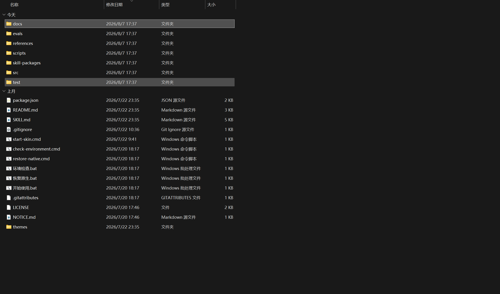
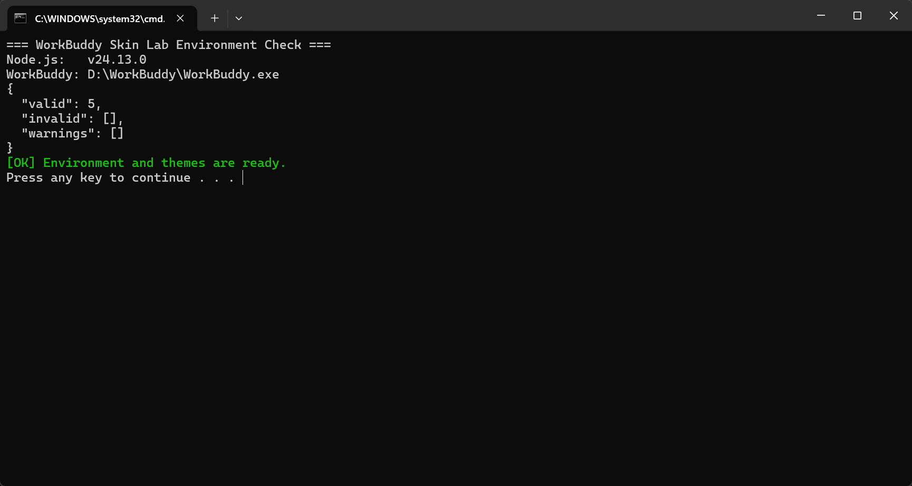

# WorkBuddy Skin Lab v1.5.1：小白安装使用教程

这是一份讲“下载、解压、检查、启动、换背景、粒子特效和恢复”的图文教程。照着做，不需要懂代码。

> v1.5.1 只扩展背景和粒子层：不替换 WorkBuddy 的文字、图标、卡片、宠物或其它组件，避免 WorkBuddy 更新后出现错位和内容丢失。

## 一、先准备好

你需要：

- Windows 10 或 Windows 11；
- 已安装 WorkBuddy 桌面端；
- Node.js 22 或更高版本。

已验证 WorkBuddy 5.3.8。普通换背景不需要 API Key、Python、Pillow 或 Codex。

## 二、下载正确的 Windows 发布包

打开 [v1.5.1 发布页](https://github.com/sysxdc/workbuddy-skin-lab/releases/tag/v1.5.1)，下载：

```text
WorkBuddy-Skin-Lab-1.5.1-Windows.zip
```

第一次安装只需要 `Windows.zip`。名称带 `Skill.zip` 的文件用于可选的 AI 生成背景功能，不是普通换背景的必需文件。

## 三、完整解压

在 Windows“下载”文件夹中找到 ZIP，右键选择“全部解压缩”。

进入解压后的同名文件夹。不要直接在 ZIP 压缩包内部双击入口，否则脚本可能找不到其它文件。



> 图片只用于说明解压后的目录位置；不同发布版本的文件数量和日期可能不同。

主要入口如下：

```text
环境检查.bat   检查电脑环境
开始使用.bat   启动 WorkBuddy 并应用背景
恢复原生.bat   恢复 WorkBuddy 原生界面
```

英文入口 `check-environment.cmd`、`start-skin.cmd`、`restore-native.cmd` 与中文入口作用相同。

## 四、检查环境

双击 `环境检查.bat`。如果看到 Node.js 版本、WorkBuddy 路径，以及最后的：

```text
[OK] Environment and themes are ready.
```

说明环境正常。



> `valid` 数量会随本机主题数量变化，只要 `invalid` 为空且最后显示 `[OK]` 即可。

如果检查失败，看窗口中标记为 `[FAIL]` 的一行：

- 没有 Node.js：安装 Node.js 22 或更高版本；
- 找不到 WorkBuddy：确认软件已安装并能正常打开；
- 主题检查失败：重新下载并完整解压 Windows 发布包。

WorkBuddy 安装在 `D:\WorkBuddy\WorkBuddy.exe` 时会自动识别。其它自定义目录可通过 `WORKBUDDY_EXE` 环境变量指定完整路径。

## 五、启动并换背景

1. 保存 WorkBuddy 中正在进行的任务。
2. 双击 `开始使用.bat`。
3. 首次启动可能会自动关闭并重新打开 WorkBuddy，这是正常现象。
4. WorkBuddy 右上角出现 `🎨` 后，点击打开面板。
5. 在“主题与背景”中切换候选，或点击“指定自己的图片”。
6. 在“显示效果”中按需设置浅色/深色、背景安全区、任务页背景和回答阅读层。
7. 在“环境粒子特效”中选择雨、雷雨、雪、爱心、星星、自定义符号或 AI 自定义素材，并调整强度、速度和颜色。
8. 确认效果后，点击“保存当前主题（下次启动）”。

界面中的首页标题、选项、输入框、回答内容和顶部工具栏仍由 WorkBuddy 原生渲染，不会被主题替换。

## 六、选择合适的背景图

建议图片规格：

- 推荐 2560×1440，最低 1920×1080，16:9，sRGB；
- 推荐 WebP/JPEG，质量 80%–90%，建议小于 5 MB；
- 重要主体放在右侧，中央和左侧保留简洁区域；
- 四周保留约 10% 安全边距；
- 避免中央出现嵌入文字、强高光和高对比密集纹理。

支持 PNG、JPEG、WebP、GIF 和 SVG。普通图片硬限制 20 MB；GIF/SVG 原样保存，限制 3 MB。动态 GIF 可以作为背景，但可能更耗资源，建议优先使用静态 WebP/JPEG。

## 七、显示效果怎么选

- **浅色/深色**：先用“自动匹配图片”；若原生控件对比度不合适，再手动选浅色或深色。
- **背景安全区**：人物在右侧时选“左侧”，减少背景对侧边栏和主要操作区的干扰。
- **任务页背景**：推荐“自动（柔和）”；只想在顶部看到图片时选“仅顶部展示”。
- **回答阅读层**：复杂背景上建议保持“显示（更清晰）”。

这些选项只控制背景及其可读性保护，不替换 WorkBuddy 的业务组件。

## 八、环境粒子特效

- **粒子特效**：可选关闭、下雨、雷雨、下雪、冒爱心、下星星或自定义符号。
- **粒子强度**：性能较弱的电脑建议选择“轻”。
- **粒子速度**：可选慢、正常或快。
- **粒子颜色**：点击颜色框自由选择。
- **自定义符号**：最多两个 Unicode 字符，例如 `🌸`、`♫` 或 `✨`。
- **AI 自定义素材**：安装两个 Skill 后，可生成三张透明 PNG 候选；选定后会创建用户派生主题。选中缩略图后可调整飘落/上浮/漂浮/横向掠过、摆动、旋转、缩放起伏和闪烁。

粒子位于背景层，不接收点击，不会遮挡 WorkBuddy 的按钮、输入框和弹窗。Windows 开启“减少动态效果”时，动画会自动停止。设置按主题保存，“重置本主题”会清除该主题的粒子设置。

不同粒子有各自的自然轨迹：雪花左右飘落，爱心摇摆上浮，星星闪烁下落，自定义符号自由漂浮。粒子位置、延迟和漂移会独立打散，不会再排成规则斜线。

## 九、恢复原生界面

双击 `恢复原生.bat`，或在 `🎨 → 恢复与重置` 中选择“恢复原生界面”。

恢复操作只移除当前注入效果，不删除已保存的主题。以后重新运行 `开始使用.bat`，仍可再次应用。

## 十、常见问题

### 双击三个入口没有反应

确认已经完整解压。可在解压文件夹地址栏输入 `powershell`，再运行：

```powershell
.\环境检查.bat
```

这样窗口不会一闪而过，可以看到具体错误。

### 环境检查找不到 WorkBuddy

先确认 WorkBuddy 能正常打开。D 盘常见路径会自动查找；其它路径请设置 `WORKBUDDY_EXE`，不要修改 WorkBuddy 安装文件。

### 右上角没有 `🎨`

保存任务，完全退出 WorkBuddy，再依次运行 `环境检查.bat` 和 `开始使用.bat`。如果仍未出现，检查端口 `9223` 是否被占用。

### 旧主题中的宠物、文字或装饰不见了

这是 v1.5.1 的预期行为。旧功能依赖 WorkBuddy 内部页面结构，更新后无法可靠对齐，已经移除。旧主题的背景和内置粒子仍可使用。

### 为什么没有顶部图案或顶部文字

顶部图文容易与新版 WorkBuddy 工具栏重叠，已经从运行时和设置面板中移除。以前保存的顶部图文数据不会再渲染。

### 图片看起来太暗、太糊或影响操作

先把任务页背景设为“自动（柔和）”或“仅顶部展示”，保持回答阅读层开启，再调整背景安全区。更换图片时优先选择中央和左侧干净的 16:9 图片。

## 十一、隐私与安全

- 不要把 API Key 发到聊天、截图或 GitHub；
- 不要上传含私人信息的截图和主题；
- 不要把本机调试端口暴露到公网；
- 只使用自己拥有合法使用权的图片。
