# 一键定制专属于你的 WorkBuddy 皮肤

> WorkBuddy Skin Lab v1.4.1

不是简单换一张壁纸，而是让每天打开的工作台，真正变成你喜欢的样子。

**5 套主题实机展示 · 6 种粒子氛围 · 一键应用 · 随时恢复**

[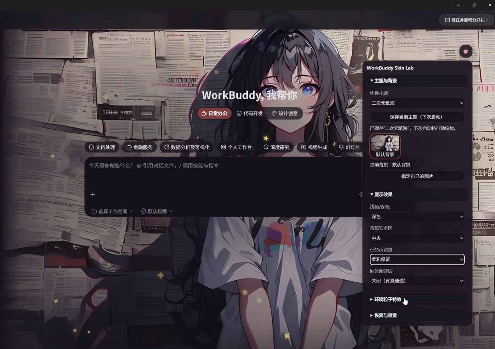](assets/workbuddy-skin-demo-v1.4.1-private.mp4)

> 点击封面图查看实机效果视频。GitHub 无法直接播放时，可打开视频文件后下载查看。

## 先选择适合你的使用路线

- **AI 一句话生成主题**：安装 `NoneLinear-Image` 和 `WorkBuddy-Skin-Lab` 两个 Skill，并提前配置图片生成服务。适合想从文字描述直接得到背景的读者。
- **直接使用本地图片**：只下载 Windows 工具包，不需要图片生成服务。适合已经准备好背景图的读者。

正式文件均来自 [WorkBuddy Skin Lab v1.4.1 Release](https://github.com/sysxdc/workbuddy-skin-lab/releases/tag/v1.4.1)。

## 先看效果：同一个 WorkBuddy，五种完全不同的氛围

从二次元、科技感到治愈系和春日系，背景、明暗与阅读保护会一起适配。下面均为 WorkBuddy 实机切换后的效果。

### 二次元纸海

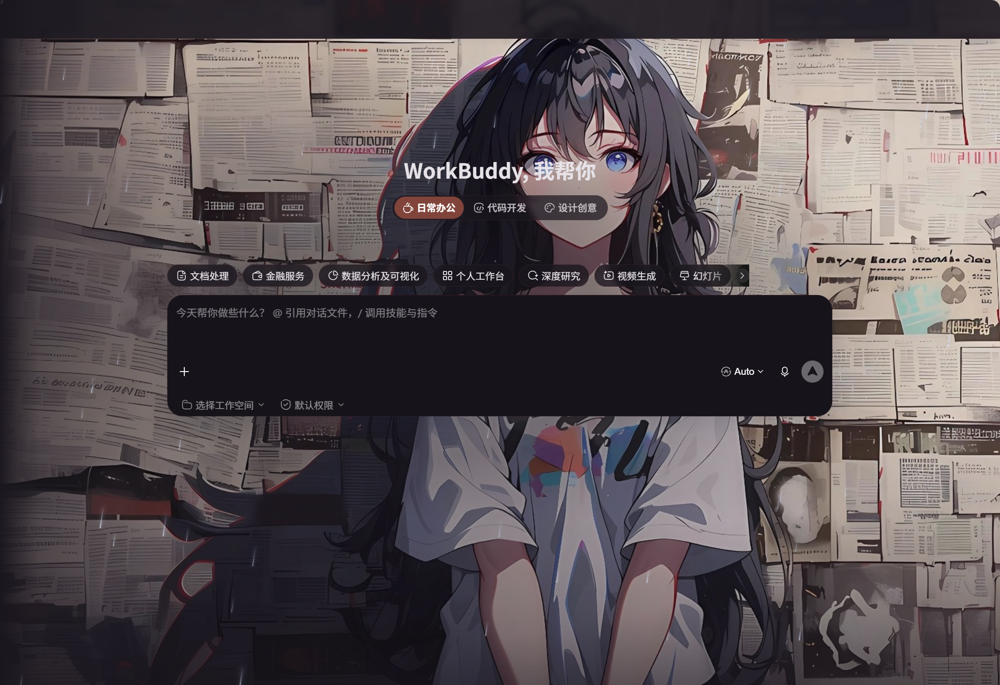

报纸纹理与角色画面结合，深色工作台更有沉浸感。

### 极光实验室

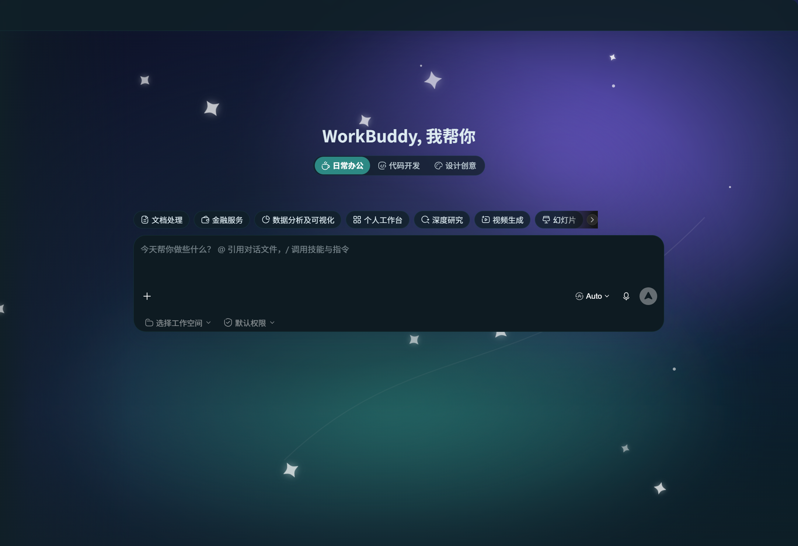

紫蓝极光搭配星光粒子，简洁又有科技感。

### 居家陪伴

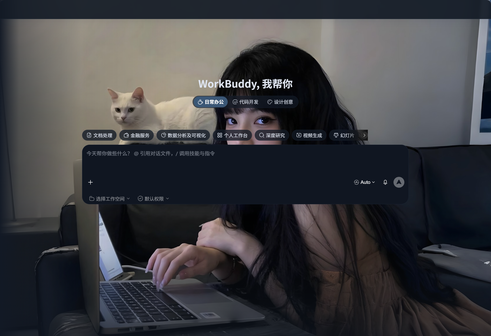

柔和自然光与猫咪，让工作界面多一点治愈感。

### 暮色纸灯

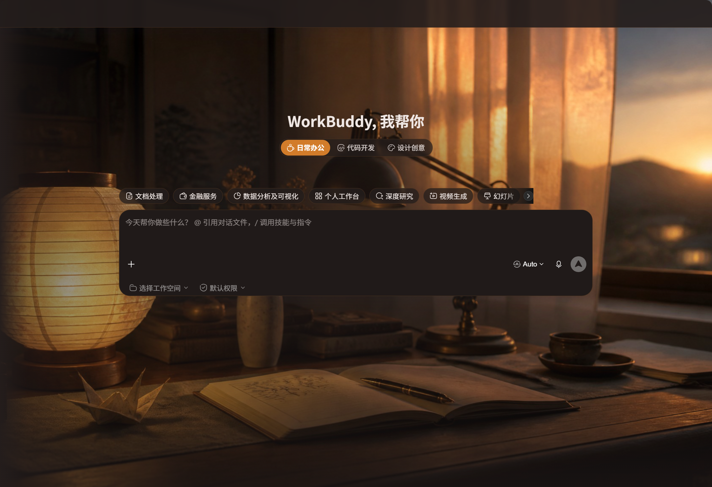

暖色桌面和落日氛围，适合安静专注的夜晚。

### 樱庭协奏

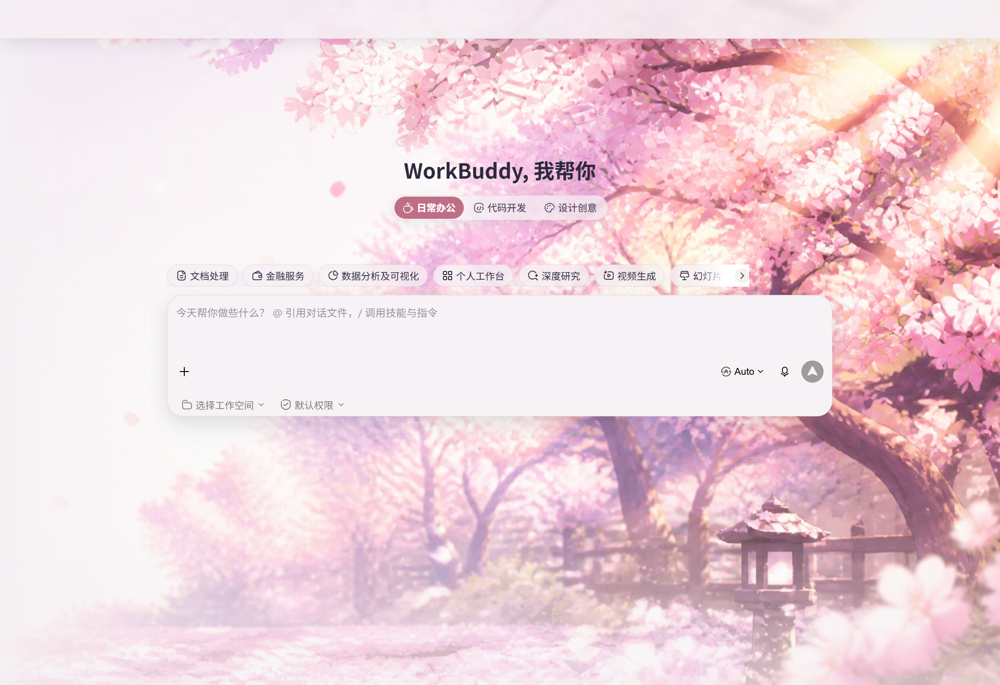

明亮樱花庭院，让工作台瞬间拥有春日气息。

你只需要选一张喜欢的背景，再点几下设置，就能做出完全不同的工作氛围。

> 不改安装文件，不替换原生按钮和文字。只扩展背景与粒子层，想恢复时也能一键回到原样。

## 1. 为什么说是一键定制？

- **一句话生成主题**：说出喜欢的角色与氛围，让两个 Skill 协作生成并整理成主题。
- **随心换背景**：也可以直接上传 PNG、JPEG、WebP、GIF 或 SVG 等本地图片。
- **六种粒子效果**：雨、雷雨、雪花、爱心、星星和自定义符号都有不同的运动轨迹。
- **不干扰操作**：粒子只在背景层显示，不接收点击，不挡按钮、输入框和弹窗。

### 六种氛围，一键切换

| 🌧 下雨 | ⛈ 雷雨 | ❄ 下雪 |
|---|---|---|
| ♥ 爱心 | ★ 星星 | ✨ 自定义 |

## 2. 实战：一句话生成宇智波鼬主题

下面不讲抽象概念，直接从零做一套暗红月夜、乌鸦与细雨氛围的宇智波鼬皮肤。整个过程都在 WorkBuddy 里完成。

开始前请确认：

- WorkBuddy 桌面端能够正常打开；
- 已从 [v1.4.1 Release](https://github.com/sysxdc/workbuddy-skin-lab/releases/tag/v1.4.1) 下载两个 Skill ZIP；
- 图片生成服务已按 [NoneLinear 配置说明](../references/NONELINEAR_SETUP.md) 完成设置。

### 第一步：先导入两个 Skill

进入 WorkBuddy 的“技能”页面，点击右上角“添加技能”，依次选择下面两个 ZIP 文件导入。不要解压 Skill ZIP：

1. `NoneLinear-Image-0.1.0-Skill.zip`：负责生成背景候选图；
2. `WorkBuddy-Skin-Lab-1.4.1-Skill.zip`：负责把图片整理成可应用的 WorkBuddy 主题。

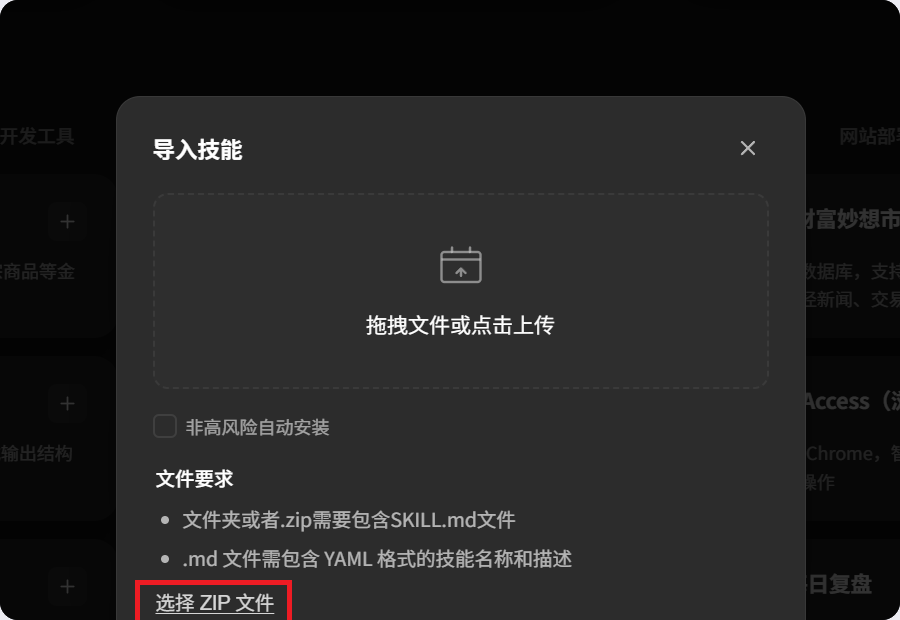

每次选择一个 ZIP，完成后再导入第二个。导入完成后，在“我安装的”中确认两个 Skill 都已出现。

### 第二步：新建任务，输入一句话

同时调用两个 Skill，并描述角色、色调、画面元素和人物位置。可以直接复制下面这段：

```text
@nonelinear-image @workbuddy-skin-lab 帮我制作一张宇智波鼬主题的 WorkBuddy 背景图并应用：暗红月夜、乌鸦与细雨，人物放在画面右侧，左侧留出低细节操作区，整体深色、16:9。
```

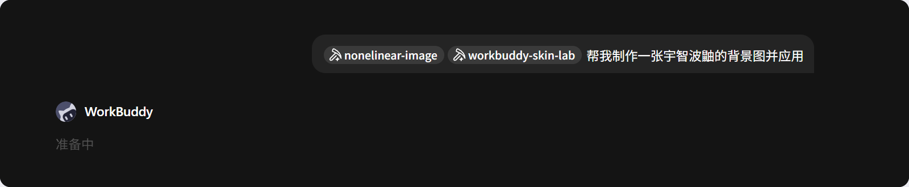

看到两个 Skill 标签都出现在消息前方，再发送任务。

### 第三步：阅读确认信息，再开始生成

WorkBuddy 会先检查环境，并说明候选图数量、尺寸和图片服务调用次数。先核对调用次数、模型和尺寸；确认符合预期后，再选择“确认，开始生成”。

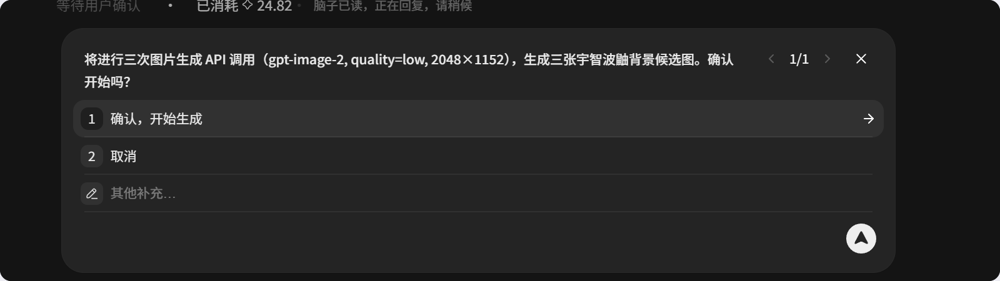

示例生成 3 张 2048×1152 候选图；实际内容以你的确认卡片为准。

### 第四步：选择喜欢的候选图并应用

生成完成后选择最满意的一张。WorkBuddy 会自动整理主题配色、人物焦点和左侧安全区，并给出主题应用脚本。不同电脑生成的脚本名称和保存位置可能不同，以当前任务中的实际提示为准。

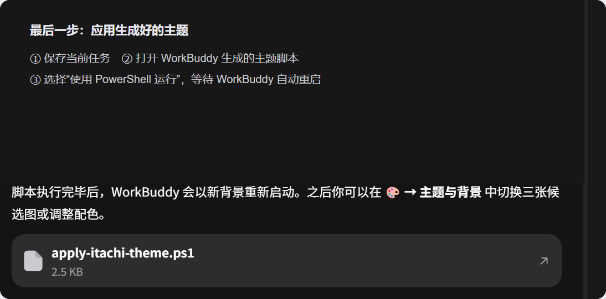

先保存当前任务，再按提示运行脚本；脚本位置会因电脑而不同。

### 第五步：宇智波鼬皮肤已经生效

WorkBuddy 重启后，背景、深色配色、左侧操作安全区和雨滴效果会一起出现。右上角 `🎨` 仍可继续切换候选图、调整粒子强度或恢复原生界面。

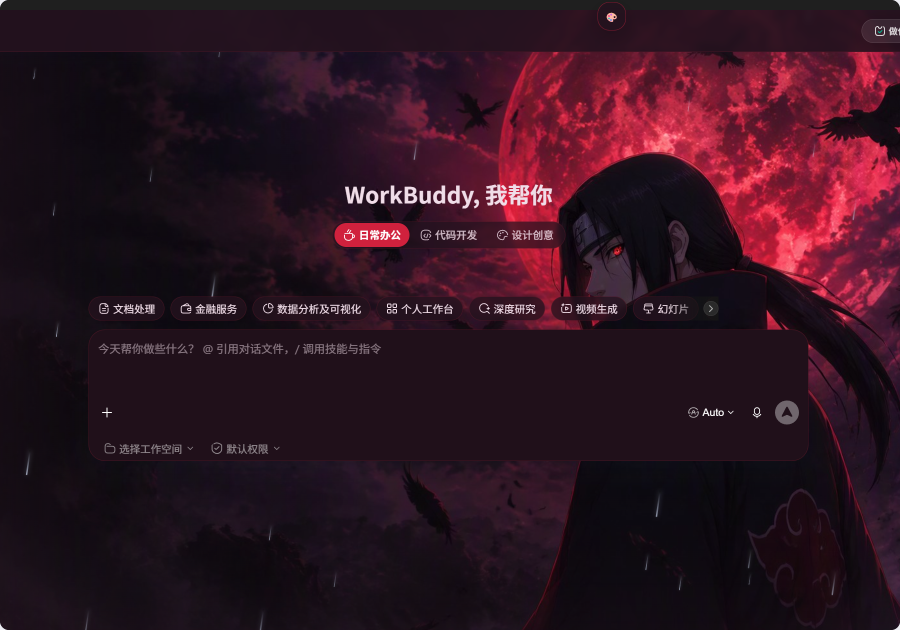

实机效果：人物位于右侧，主要操作区域保持清晰。

> 同样的方法，把“宇智波鼬”换成喜欢的角色、城市、季节或画风，就能继续生成属于自己的主题。

## 3. Windows 工具包安装教程

如果你不需要 AI 生成，只想直接上传自己的本地图片，安装 Windows 工具包即可。准备好 Windows 10/11、WorkBuddy 桌面端，以及 Node.js 22 或更高版本，照着下面做。

**领取工具包 → 完整解压 → 环境检查 → 开始使用**

### 第一步：领取工具包，下载正确的文件

关注公众号“大模型评测及优化Nonelinear”后，私信关键词“皮肤”。收到工具包后，普通用户只需要选择文件名以 `Windows.zip` 结尾的压缩包；也可以直接前往 [v1.4.1 Release](https://github.com/sysxdc/workbuddy-skin-lab/releases/tag/v1.4.1) 下载。

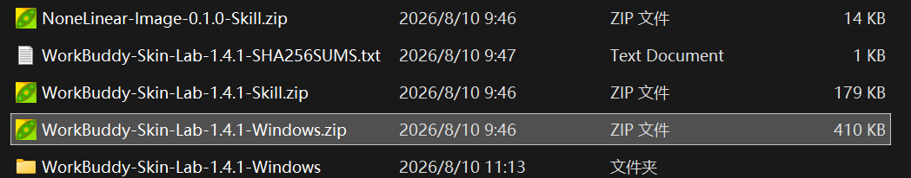

认准：`WorkBuddy-Skin-Lab-1.4.1-Windows.zip`

| 文件 | 用途 |
|---|---|
| `Windows.zip` | 普通用户下载，包含换背景和粒子效果所需文件 |
| `Skill.zip` | 用于可选的 AI 生成背景，第一次安装可以不下载 |
| `SHA256SUMS` | 用于高级用户校验文件完整性，不是安装程序 |

### 第二步：右键“全部解压缩”

不要直接在 ZIP 压缩包里双击文件。完整解压后进入新文件夹，确认能看到：

- `环境检查.bat`
- `开始使用.bat`
- `恢复原生.bat`

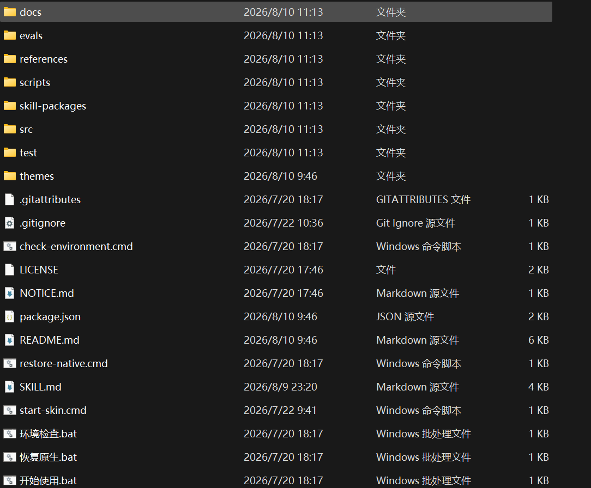

文件数量可能随版本变化，三个入口存在即可。

> 如果 Windows 阻止运行：右键下载的 ZIP → 属性 → 勾选“解除锁定”，再重新解压。

### 第三步：双击“环境检查.bat”

检查会确认 Node.js 版本、WorkBuddy 安装位置和主题文件是否正常。看到最后一行绿色 OK 即可继续。

```text
=== WorkBuddy Skin Lab Environment Check ===
Node.js: v22+
WorkBuddy: detected
[OK] Environment and themes are ready.
```

- 没有 Node.js：先安装 Node.js 22 或更高版本。
- 找不到 WorkBuddy：先确认桌面端可以正常打开。

### 第四步：保存任务，再双击“开始使用.bat”

工具可能会短暂关闭并重新打开 WorkBuddy。等窗口恢复后，右上角出现 `🎨` 按钮，就说明皮肤已应用。

> 首次运行前先保存正在编辑的内容，避免 WorkBuddy 重启时丢失未保存状态。

### 第五步：在 🎨 面板里调整效果

先选择背景，再调整背景安全区、任务页背景和回答阅读层。最后按喜好开启雨、雷雨、雪、爱心、星星或自定义粒子。

第一次使用推荐：

```text
自动匹配图片
+ 左侧安全区
+ 任务页柔和保留
+ 回答阅读层开启
+ 轻量雪花
```

### 第六步：不喜欢？随时恢复原生

双击“恢复原生.bat”，或在 `🎨` 面板中选择“恢复原生界面”。它只移除当前显示效果，不修改 WorkBuddy 安装文件。

## 领取工具包

关注公众号“大模型评测及优化Nonelinear”：

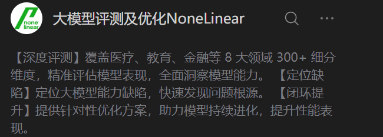

关注后发送私信关键词：**皮肤**

即可获得 WorkBuddy Skin Lab v1.4.1 工具包与小白安装教程。

建议先收藏本文，安装时按步骤逐项操作。
